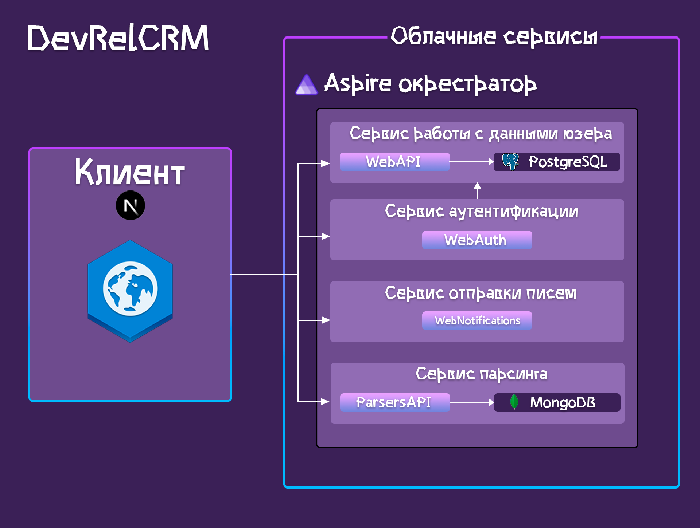

# DevRelCRM

     

## Информация о проекте
Это CRM проект для DevRel специалиста выполненный в рамках хакатона «DevRel Hack 2.0» 💥  
В проекте используется Next.js на компонентах TSX (фронтенд) и ASP.NET с "чистой архитектурой" также известная как луковая архитектура (бекенд) 🐱‍👤.  

## Требования для развёртывания 👓

| Программное обеспечение | Версии                                        |
|-------------------------|-----------------------------------------------|
| Docker                  | 24.0.6                                        |
| Node.js                 | 10.2.4                                        |
| .NET                    | 8.100                                         |
| PostgreSQL              | 16.0 (+ добавление миграций EntityFramework) |
| MongoDB                 | 7.0.4                                         |

## Схема проекта 👀

## Техническая часть проекта 👨‍💻
Клиентская часть поделена на гибкие компоненты, которые удобно встраиваются в страницу. Запросы сервера фетчатся с использованием библиотеки axios.  
На сайте определены _страницы_ : 
- Главная страница (/)
- Дашборд (/dashboard)
- Информация о пользователях (/dashboard/users)
- Редактирование пользователях (/dashboard/users/edit/[name])
- Информация о проектах организации (/dashboard/projects)
- Информация о прошедших мероприятиях (/dashboard/last-events)
- Календарь мероприятий и тасков специалиста (/calendar)
- Форма для отправки писем с шаблонизатором (/message-sending)
- Интеграция с канбан-досками (/miro) 

На стороне сервера определены микросервисы :
- WebAPI - содержит запросы для работы с данными пользователей системы
- WebAuth - содержит формы регистрации и логина 
- WebNotifications - содержит запросы отправки электронных писем с вложениями и по шаблонам
- ParsersAPI - содержит endpoint для парсинга статей и новостей Хабра

Микросервисы взаимодействуют с базами данных PostgreSQL и MongoDB используя для этого инфраструктурный слой. Данные бизнес-логики (слой Core) маппятся к ViewModel и DTO используя AutoMapper слоя Application.

На таблице приведённой ниже указаны сервисы, которые взаимодействуют с БД. 

| База данных / API | WebAPI | WebAuth | WebNotifications | ParsersAPI |
|-------------------|--------|---------|------------------|------------|
| PostgreSQL        | ✔️      | ❌       | ❌                | ❌          |
| MongoDB           | ❌      | ❌       | ❌                | ✔️          |

В проекте присутствует оркестратор контейнеров Aspire, который является стартапом для поднятия приложения. В данном проекте Aspire реализован слабо, так как на момент проектирования технология является сырой (находится в preview). Чтобы добавить Aspire нужно скачать .NET Aspire SDK в VS 2022 Preview. И после установки ввести комманды
>dotnet workload update 
>dotnet workload install aspire 

Для настройки отправки сообщений в WebNotifications требуется добавить данные SMTP-сервера. 
